# Architecture du Site Web - Électricien Pro

## Vue d'ensemble
Site web professionnel pour une entreprise d'électriciens avec spécialisation bornes de recharge véhicules électriques.

## Stack Technique

### Frontend
- **HTML5** - Structure sémantique
- **CSS3** - Variables CSS, Grid, Flexbox, animations
- **JavaScript Vanilla (ES6+)** - Interactivité
- **GSAP + ScrollTrigger** - Animations avancées au scroll
- **Intersection Observer API** - Déclenchement d'animations

### Librairies Externes (CDN)
- **GSAP 3.x** - Animation library
- **Lucide Icons** - Icônes modernes
- **Google Fonts** - Orbitron (titres), Inter (corps)

## Structure des Fichiers

```
Site_Web_Benoit/
├── index.html              # Page principale
├── css/
│   ├── variables.css       # Variables CSS (couleurs, espacements)
│   ├── base.css           # Reset et styles de base
│   ├── components.css     # Composants réutilisables
│   ├── animations.css     # Keyframes et animations
│   ├── sections/          # Styles par section
│   │   ├── hero.css
│   │   ├── services.css
│   │   ├── simulator.css
│   │   ├── gallery.css
│   │   ├── testimonials.css
│   │   ├── coverage.css
│   │   ├── faq.css
│   │   └── contact.css
│   └── responsive.css     # Media queries
├── js/
│   ├── main.js            # Point d'entrée
│   ├── loader.js          # Animation de chargement
│   ├── particles.js       # Effet particules
│   ├── scroll-animations.js # Animations au scroll
│   ├── simulator.js       # Logique simulateur devis
│   ├── gallery.js         # Filtre galerie
│   ├── carousel.js        # Carousel témoignages
│   ├── map.js             # Carte zone intervention
│   ├── accordion.js       # FAQ accordéon
│   └── form-validation.js # Validation formulaire
├── assets/
│   ├── images/            # Images du site
│   ├── icons/             # Icônes SVG personnalisées
│   └── fonts/             # Polices locales si besoin
└── plans/                 # Documentation
```

## Palette de Couleurs

### Couleurs Principales
- **Bleu Électrique** : `#00D4FF` - Actions principales, accents
- **Jaune Néon** : `#FFE600` - Énergie, alertes positives
- **Vert Néon** : `#39FF14` - Validation, éco-responsable
- **Noir Profond** : `#0A0A0F` - Fond principal
- **Gris Foncé** : `#1A1A24` - Surfaces secondaires

### Couleurs de Support
- **Blanc Cassé** : `#F0F0F5` - Texte principal
- **Gris Moyen** : `#8A8A9A` - Texte secondaire
- **Gris Clair** : `#2A2A3A` - Bordures, séparateurs

## Typographie

### Polices
- **Titres** : Orbitron (sans-serif technologique)
- **Corps** : Inter (lisible, moderne)

### Échelle Typographique
- Hero : 4rem (64px)
- H1 : 3rem (48px)
- H2 : 2.25rem (36px)
- H3 : 1.5rem (24px)
- Corps : 1rem (16px)
- Petit : 0.875rem (14px)

## Composants Clés

### 1. Loader Électrique
- Animation SVG prise électrique ou éclair
- Transition fluide vers le contenu
- Durée : 2-3 secondes maximum

### 2. Hero Section
- Animation circuit électrique en arrière-plan (Canvas/SVG)
- Titre avec effet néon
- CTA urgent avec micro-interaction
- Particules animées subtils

### 3. Cartes de Services
- Icônes animées au hover
- Effet surbrillance électrique
- 3D tilt effect au survol

### 4. Simulateur de Devis
- Formulaire multi-étapes
- Calcul en temps réel
- Validation instantanée
- Résultat avec animation

### 5. Galerie Réalisations
- Grid masonry
- Filtres par catégorie
- Lightbox au clic
- Lazy loading

### 6. Carousel Témoignages
- Auto-play avec pause au hover
- Navigation tactile
- Transition slide fluide

### 7. Carte Zone Intervention
- SVG interactif ou intégration Leaflet
- Animation zone de couverture
- Points d'intérêt animés

### 8. FAQ Accordéon
- Animation smooth open/close
- Icône rotation
- Un seul ouvert à la fois

### 9. Formulaire Contact
- Validation en temps réel
- États visuels (focus, error, success)
- Animation envoi

## Animations & Interactions

### Au Scroll (GSAP ScrollTrigger)
- Révélation progressive des éléments
- Parallax sur images de fond
- Compteurs animés pour statistiques
- Sticky headers

### Micro-interactions
- Hover boutons : glow électrique, scale
- Hover cartes : lift + shadow
- Focus inputs : border néon
- Clic : ripple effect

### Effets Spéciaux
- Particules électriques en arrière-plan
- Surbrillance électrique au survol
- Transition de page douce

## Responsive Breakpoints

- **Mobile** : < 640px
- **Tablet** : 640px - 1024px
- **Desktop** : > 1024px
- **Large** : > 1440px

## SEO & Performance

### SEO Local
- Schema.org LocalBusiness
- Meta tags géolocalisation
- Open Graph complet
- Sitemap XML

### Core Web Vitals
- LCP < 2.5s
- FID < 100ms
- CLS < 0.1
- Images optimisées (WebP, lazy loading)
- CSS critique inline
- JS différé

## Accessibilité
- Contraste WCAG AA minimum
- Navigation clavier complète
- ARIA labels
- Réduction de mouvement respectée

## Diagramme d'Architecture

```mermaid
flowchart TB
    subgraph Frontend
        HTML[index.html]
        CSS[Styles CSS]
        JS[JavaScript]
    end
    
    subgraph CSS_Structure
        V[variables.css]
        B[base.css]
        C[components.css]
        A[animations.css]
        S[sections/*.css]
        R[responsive.css]
    end
    
    subgraph JS_Modules
        L[loader.js]
        P[particles.js]
        SA[scroll-animations.js]
        SIM[simulator.js]
        G[gallery.js]
        CAR[carousel.js]
        M[map.js]
        ACC[accordion.js]
        F[form-validation.js]
    end
    
    subgraph Sections
        H[Hero]
        SER[Services]
        SIM_S[Simulateur]
        GAL[Galerie]
        T[Testimonials]
        COV[Coverage Map]
        FAQ_S[FAQ]
        CON[Contact]
    end
    
    HTML --> CSS
    HTML --> JS
    CSS --> V & B & C & A & S & R
    JS --> L & P & SA & SIM & G & CAR & M & ACC & F
    HTML --> H & SER & SIM_S & GAL & T & COV & FAQ_S & CON
```



## Plan de Développement

1. **Phase 1** : Structure HTML sémantique
2. **Phase 2** : Variables CSS et base styles
3. **Phase 3** : Composants réutilisables
4. **Phase 4** : Sections individuelles
5. **Phase 5** : Animations JavaScript
6. **Phase 6** : Responsive et optimisations
7. **Phase 7** : SEO et performance
